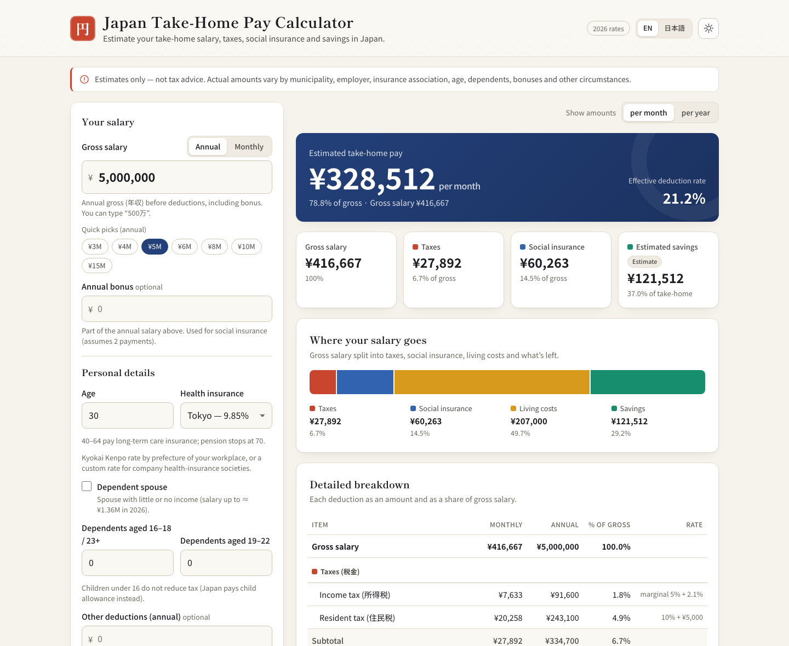
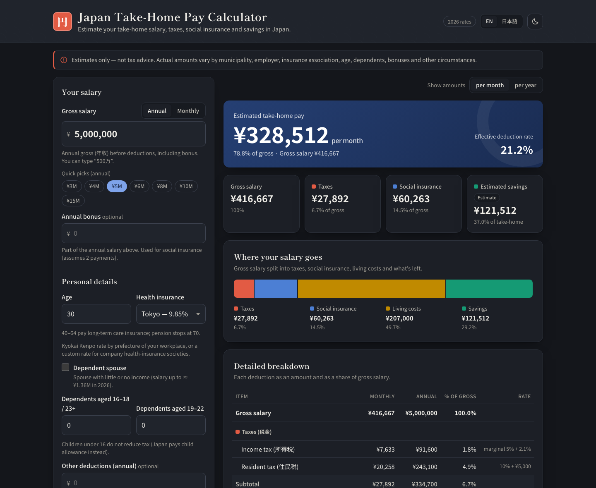
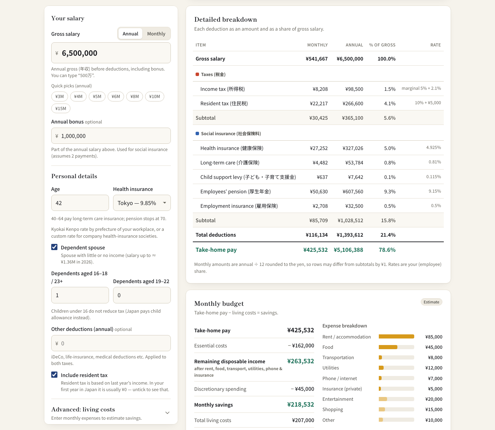
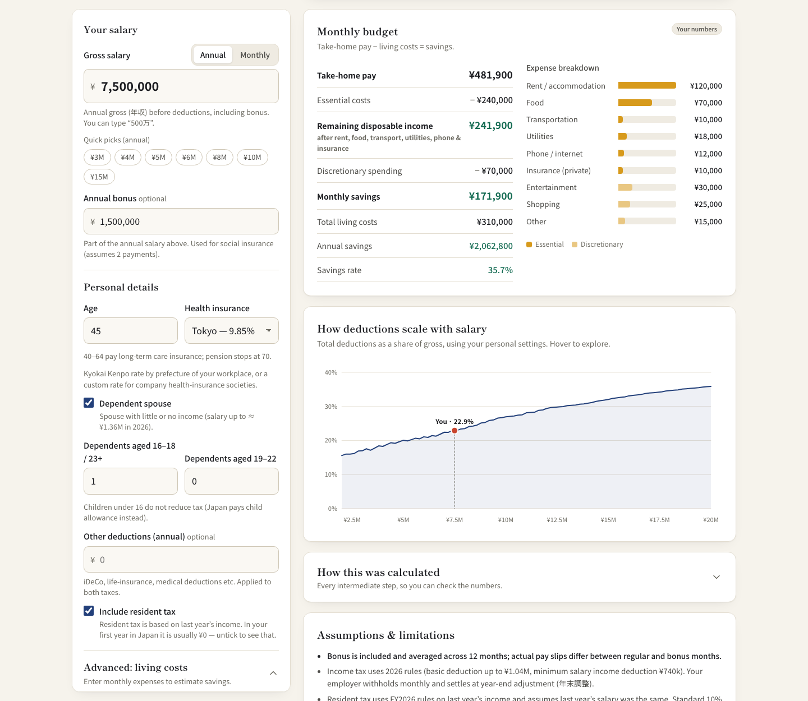
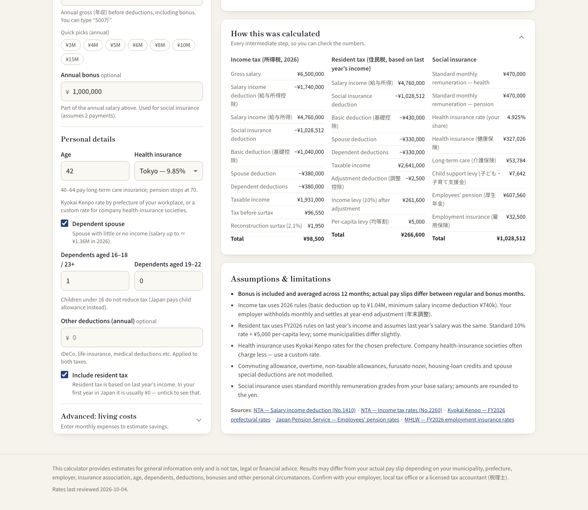
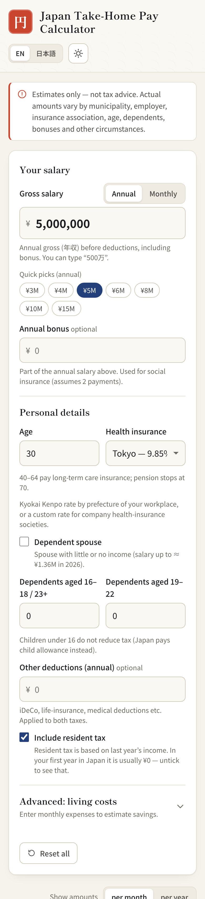
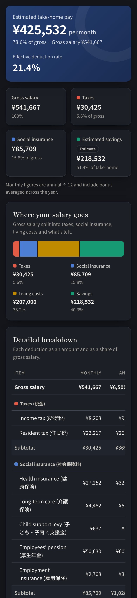

# Japan Take-Home Pay Calculator · 日本の手取り給与計算ツール

[](https://mohakamran.github.io/japan-salary-calculator/)


A fast, transparent calculator for people working in Japan. Enter your gross salary (monthly or annual) to estimate your **take-home pay, taxes, social insurance, living costs and savings**. It is a static site built with plain HTML, CSS and JavaScript: there is no build step, no backend and no framework.

**▶ Live demo: https://mohakamran.github.io/japan-salary-calculator/**



> **Estimates only, not tax advice.** Actual amounts vary by municipality, prefecture, employer, health-insurance association, age, dependents, deductions, bonuses and other personal circumstances. Check with your employer, your local tax office or a licensed tax accountant (税理士).

## Contents

- [Screenshots](#screenshots)
- [Features](#features)
- [Project structure](#project-structure)
- [How the calculation works](#how-the-calculation-works)
- [Updating Japanese tax and insurance rates](#updating-japanese-tax-and-insurance-rates)
- [Run locally](#run-locally)
- [Deploy to GitHub Pages](#deploy-to-github-pages)
- [Sources](#sources)
- [Disclaimer](#disclaimer)


## Screenshots

| Dark theme | Japanese UI + Advanced mode (living costs) |
| --- | --- |
|  |  |

**Detailed breakdown.** Each deduction is shown monthly and annually, as a % of gross, and with your rate. Taxes and social insurance are grouped separately. This example is ¥6.5M with a ¥1M bonus, age 42, a spouse and one dependent.



**Monthly budget and salary curve.** Take-home minus living costs gives your savings. The chart shows how deductions scale with salary, with your position marked.



**Transparent calculation.** Every intermediate value is shown so you can check the numbers.



| Mobile | Mobile, dark |
| --- | --- |
|  |  |

---

## Features

- **Monthly or annual input.** Switching between them converts the value, so the result stays the same. Inputs accept `5,000,000`, `500万`, `5m`, `300k` and full-width digits.
- **Deductions estimated:** income tax (所得税, including the 2.1% reconstruction surtax), resident tax (住民税), health insurance (健康保険), long-term care insurance (介護保険, ages 40–64), the child & childcare support levy (子ども・子育て支援金), employees' pension (厚生年金) and employment insurance (雇用保険).
- **Every item shows the amount, the % of gross and your rate**, with monthly and annual columns. Taxes and social insurance appear in separate groups.
- **Personal factors:** age, prefecture (all 47 Kyokai Kenpo rates) or a custom rate for a company health-insurance society, dependent spouse, dependents aged 16–18/23+ and 19–22, bonus, other deductions (iDeCo, life insurance and so on), and an option to leave out resident tax for your first year in Japan.
- **Advanced mode (living costs):** nine monthly expense categories with Tokyo, big-city and regional presets. It shows remaining disposable income after essentials, monthly and annual savings, savings rate and an expense breakdown. Preset values are labelled as estimates.
- **Visuals:** a "where your salary goes" stacked bar, expense bars, and a chart of how deductions scale with salary. The scaling chart supports hover and keyboard arrows.
- **A "How this was calculated" panel** shows every intermediate value: salary income deduction, taxable income, standard monthly remuneration, the adjustment deduction and more.
- English / 日本語 UI, light and dark themes, responsive down to 320px, and inputs saved locally in your browser.

## Project structure

```
index.html              Page markup
style.css               Styles (design tokens at the top; dark mode only swaps tokens)
js/config.js            ★ ALL rates, thresholds, tables and assumptions
js/calculator.js        Pure calculation engine (no DOM, works in browser + Node)
js/i18n.js              English / Japanese strings
js/charts.js            Dependency-free HTML/SVG charts
js/app.js               UI: form state, validation, rendering
tests/calculator.test.js  Node tests (hand-verified figures + consistency checks)
```

The calculation logic is kept separate from the UI. `calculator.js` takes plain inputs and the config object and returns a result object. It never touches the page and contains no hard-coded rates.

## How the calculation works

All amounts are worked out **annually** first. Monthly figures are annual ÷ 12, so monthly × 12 always equals the annual figure. If you enter a bonus, it is spread evenly across the 12 months.

1. **Gross salary.** Annual input is treated as 年収 and includes any bonus. Monthly input is treated as 月給, and annual gross = 12 × monthly + bonus.
2. **Social insurance (employee half of each total rate)**
   - Your monthly base pay is mapped to a **standard monthly remuneration** grade (標準報酬月額). Health insurance uses grades from ¥58k to ¥1.39M. Pension uses ¥88k to ¥650k.
   - Health: prefecture rate (or your custom rate). Care: 1.62%, ages 40–64 only. Child support levy: 0.23%. Pension: 18.3%, under age 70 only.
   - Bonuses: each payment is rounded down to ¥1,000. Pension is capped at ¥1.5M per payment and health at ¥5.73M per year. The calculator assumes 2 payments.
   - Employment insurance: 0.5% of total gross.
3. **Income tax (2026 rules)**
   - Salary income = gross − salary income deduction (minimum ¥740k, up to ¥1.95M).
   - Taxable income = salary income − social insurance − basic deduction (up to ¥1.04M, reduced at higher incomes) − spouse/dependent deductions − other deductions. It is rounded down to ¥1,000.
   - Progressive rates from 5% to 45%, × 1.021 reconstruction surtax, rounded down to ¥100.
4. **Resident tax (FY2026 rules)**
   - Resident tax is charged on **last year's** income. The calculator assumes last year's salary was the same as this year's.
   - Same structure as income tax, but with resident-tax deductions (basic ¥430k and so on). Income levy is 10%, minus the adjustment deduction (調整控除), plus the ¥5,000 per-capita levy. Very low incomes are exempt, using standard Tier-1 municipality thresholds.
5. **Take-home pay** = gross − taxes − social insurance.
6. **Budget.** Savings = take-home − living costs. Remaining disposable income = take-home − essential costs (rent, food, transport, utilities, phone, insurance).

### Important assumptions and limitations

- Income tax is calculated as a full year with year-end adjustment (年末調整). Your actual monthly withholding follows NTA withholding tables and may differ slightly from month to month.
- Kyokai Kenpo rates are used unless you enter a custom rate. Company health-insurance societies (健保組合) are often cheaper.
- Not modelled: commuting and other non-taxable allowances, overtime variation, furusato nozei, housing-loan credit, spouse *special* deduction, elderly-dependent and disability deductions, the new specific-relative special deduction, municipalities with non-standard resident-tax rates, part-time social insurance eligibility rules.
- From age 65, care premiums are taken from your pension. From age 75, the Late-Stage Elderly system applies. Neither is included, and the UI says so.
- Living-cost presets are rough guides for a single person, not official statistics.

## Updating Japanese tax and insurance rates

Everything lives in **`js/config.js`**. Nothing else needs to change for a rate update.

| What changed | Where in `config.js` |
| --- | --- |
| Income tax brackets | `incomeTax.brackets` |
| Salary income deduction (給与所得控除) | `incomeTax.salaryIncomeDeduction` and `residentTax.salaryIncomeDeduction` |
| Basic deduction (基礎控除) | `incomeTax.basicDeduction`, `residentTax.basicDeduction` |
| Spouse / dependent deductions | `*.spouseDeduction`, `*.dependentDeduction` |
| Resident tax rate / per-capita levy | `residentTax.incomeLevyRate`, `residentTax.perCapitaLevy` |
| Kyokai Kenpo prefecture rates (updated every March) | `socialInsurance.healthRatesByPrefecture` |
| Care insurance, child support levy | `socialInsurance.care.rate`, `socialInsurance.childSupportRate` |
| Pension rate / grade cap | `socialInsurance.pension` |
| Standard remuneration grades | `socialInsurance.grades` |
| Employment insurance (updated every April) | `socialInsurance.employmentInsurance.employeeRate` |
| Living-cost presets | `expenses.presets` |

Checklist:
1. Edit the values. Tables run in ascending order and the last row uses `upTo: Infinity`.
2. Update `meta.taxYear`, `meta.lastReviewed` and `meta.sources`.
3. **Resident tax lags income tax by one year.** When the new fiscal year starts in June, copy the previous income-tax-year rules into `residentTax` where they apply. For example, from June 2027 resident tax will use the 2026 salary-income-deduction rules.
4. If the change affects them, update the hand-verified figures in `tests/calculator.test.js` and the text in `js/i18n.js` (`assume.*`, `input.spouse.hint`).
5. Run the tests.

## Run locally

No install is needed. Either:

```bash
# open the file directly
open index.html

# or serve it (recommended)
python3 -m http.server 8000      # then visit http://localhost:8000
```

Run the tests (Node 18+, no dependencies):

```bash
node --test tests/
```

The tests check hand-calculated figures for ¥5M and ¥8M salaries, monthly/annual equivalence, internal consistency across ¥1M–¥50M (components sum to totals, net = gross − deductions, monthly × 12 = annual savings, take-home rises with gross), bracket continuity, age rules, dependents, bonus caps and resident-tax exemption. They also print a summary table across salary levels.

## Deploy to GitHub Pages

1. Create a repository and push these files to the `main` branch, with `index.html` at the repository root:
   ```bash
   git init && git add . && git commit -m "Japan take-home pay calculator"
   git branch -M main
   git remote add origin https://github.com/<you>/<repo>.git
   git push -u origin main
   ```
2. On GitHub, open **Settings → Pages**.
3. Under **Build and deployment**, choose **Deploy from a branch**, then select `main` and `/ (root)`. Save.
4. After about a minute the site is live at `https://<you>.github.io/<repo>/`.

All paths are relative, so the site also works from a project sub-path. The empty `.nojekyll` file tells Pages to serve the files as they are. The only external request is to Google Fonts. If it fails, the page falls back to system fonts.

## Sources

- National Tax Agency: [salary income deduction (No.1410)](https://www.nta.go.jp/taxes/shiraberu/taxanswer/shotoku/1410.htm), [income tax rates (No.2260)](https://www.nta.go.jp/taxes/shiraberu/taxanswer/shotoku/2260.htm)
- Kyokai Kenpo: [FY2026 prefectural rates](https://www.kyoukaikenpo.or.jp/about/business/insurance_rate/rate_prefectures/r08)
- Japan Pension Service: [employees' pension contribution table](https://www.nenkin.go.jp/service/kounen/hokenryo/ryogaku/ryogakuhyo/index.html)
- MHLW: [employment insurance rates](https://www.mhlw.go.jp/stf/seisakunitsuite/bunya/0000108634.html)

Rates were last reviewed on 2026-10-04.

## Disclaimer

This tool gives estimates for general information only. It is **not** tax, legal or financial advice, and it may not reflect your actual pay slip or tax bill. Rules and rates change, and individual circumstances vary. Always confirm with your employer, the National Tax Agency, your municipality, or a qualified 税理士. The authors accept no liability for decisions made using this calculator.
